## 4 系统设计

### 4.1 系统总体设计

#### 4.1.1 系统架构设计

本平台面向普通用户与系统管理员两类角色，围绕“3D 服装可视化定制”和“AI 真人试穿效果生成”构建“工具 + 社区”的一体化应用形态，系统采用“前端—后端—数据层—外部 AI 服务”的分层架构（见图4-1）。其中，前端聚焦三维渲染与交互，将复杂的服装编辑过程以参数化方式呈现并实时预览，降低创作门槛；后端统一承载鉴权与业务规则，对作品、版本与互动等数据进行一致性管理，并以标准接口向前端返回业务数据；通过任务化/异步化方式接入AI 试穿，由后端负责创建任务、维护状态与结果回写；数据层将结构化业务数据与大文件资源存储至云端，以url形式保存，并引入缓存与队列机制提升热点访问与任务处理效率，从而支撑平台的稳定运行与后续功能扩展。

系统架构图：

!\[系统架构图]\(systemArchitecture.png null)

#### 4.1.2 系统功能结构设计

系统功能结构采用“角色—业务域—功能点”的划分方式，保证前台创作与社区能力、后台治理能力相互独立又可协同。整体功能结构如下：

- 用户与权限：注册登录、JWT 鉴权、角色区分（普通用户/管理员）、个人信息维护。
- 3D 服装定制：基础模型选择、颜色与材质参数调整、图案上传与部位应用、三维交互（旋转/缩放/查看细节）、设计草稿保存。
- AI 虚拟试穿：模特体型/场景风格选择、生成任务创建、生成进度反馈、结果展示与保存。
- 作品管理：作品信息编辑、草稿、发布/下架/删除、编辑回溯。
- 创意广场与互动：作品浏览/搜索/排序（热度/时间/标签）、点赞/收藏/评论、关注创作者、个人作品主页展示。
- 后台管理：管理员登录、用户管理、作品审核（通过/拒绝/下架）、模型库维护。

### 4.2 系统功能模块设计

系统功能模块设计以“前台创作与社区 + 后台治理运营”为主线，围绕用户体系、3D 定制、AI 试穿、作品管理、创意广场互动与后台管理等核心业务模块展开。各模块之间以统一的后端接口进行解耦协作，以“作品/版本”为核心业务对象贯通数据，形成完整的创作与运营闭环。

#### 4.2.1 用户与权限模块

模块功能：该模块为系统提供身份认证与权限控制能力，覆盖用户注册、登录、退出、个人信息维护与角色权限校验等功能。系统采用 JWT 作为鉴权载体，在保证前端无状态访问的同时，实现普通用户与管理员接口的权限隔离，为作品发布、互动与后台治理提供统一的安全入口。

模块功能结构图：

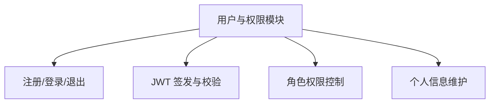

模块流程描述：用户提交账号密码完成登录后，后端校验凭证并签发 JWT；前端在后续请求中携带令牌，后端完成令牌校验与角色鉴权后返回业务数据；当用户退出或令牌失效时，前端清理本地令牌并重新进入登录流程。

模块流程图：

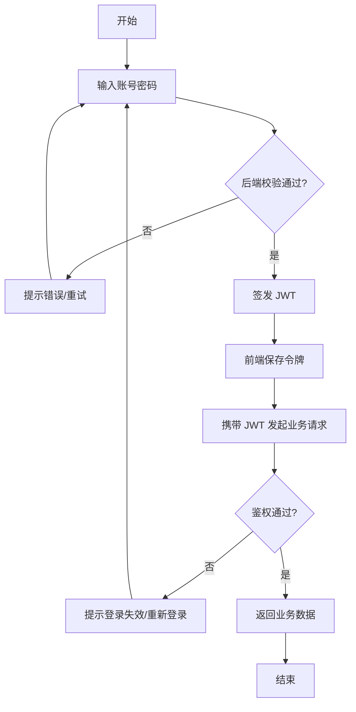

#### 4.2.2 3D 服装定制模块

模块功能：该模块在浏览器端提供三维可视化服装定制能力，支持基础模型选择、颜色与材质参数调整、图案上传与部位应用、视角控制与细节预览等操作。用户可将定制配置保存为草稿或作品版本，为作品发布提供可复用的设计数据。

模块功能结构图：

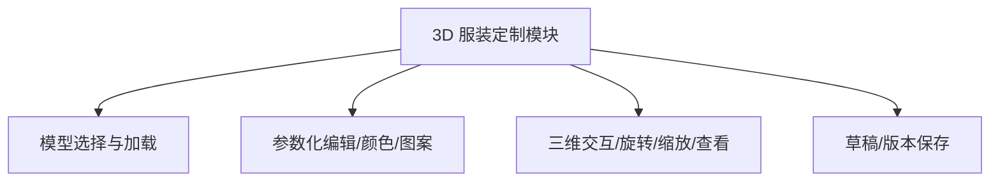

模块流程描述：用户选择基础服装模型后，前端加载模型与材质资源并渲染；用户通过交互面板调整参数并实时预览；当用户保存时，前端将关键配置参数（模型引用、材质与贴图、颜色与部位信息等）提交至后端形成草稿/版本记录，支持后续继续编辑或提审发布。

模块流程图：

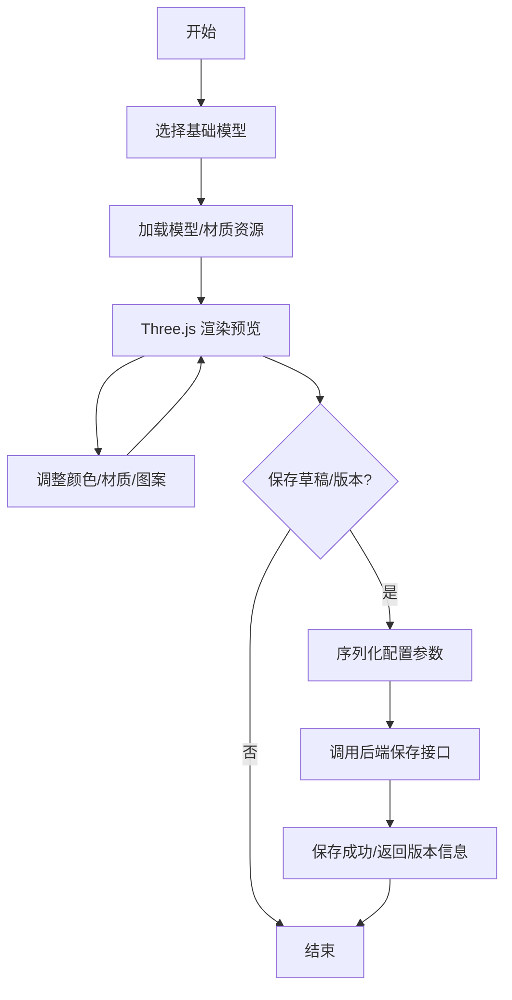

#### 4.2.3 AI 虚拟试穿模块

模块功能：该模块将用户的 3D 设计各角度平面图作为条件输入，生成高保真的真人试穿效果图。由于 AI 生成属于耗时任务，系统采用任务化/异步化机制：后端创建任务并返回任务 ID，任务执行模块从队列取出任务调用外部 AI 服务，生成结果保存至文件存储并写入数据库，前端通过查询接口获取进度并展示结果。

模块功能结构图：

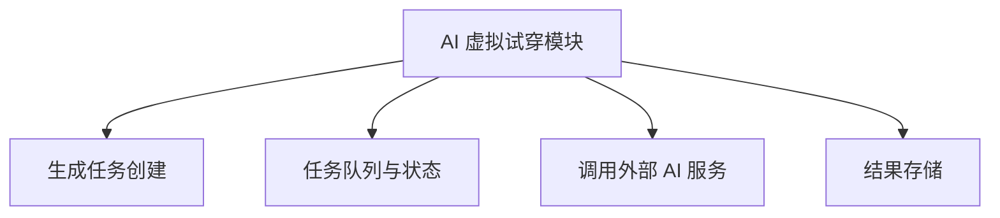

模块流程描述：用户在前端选择模特体型与场景风格后提交生成请求；后端创建任务写入队列并返回任务 ID；前端基于任务 ID 查询进度；任务执行模块消费队列调用外部 AI，生成完成后上传结果文件并写入版本数据，更新任务状态；前端获取到完成状态后展示试穿图并允许用户保存。

模块流程图：

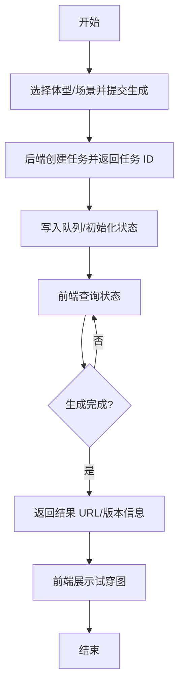

#### 4.2.4 作品管理模块

模块功能：该模块面向普通用户提供作品全生命周期管理能力，包含作品创建、信息编辑、草稿、发布/下架、删除等功能。

模块功能结构图：

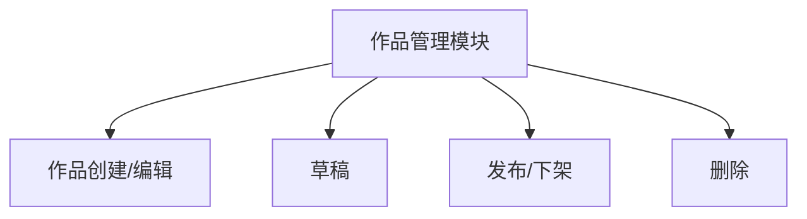

模块流程描述：用户创建作品并编辑标题、描述等信息；编辑完成后存储为草稿可选择提审发布，后端更新作品状态与发布时间；当用户下架或删除作品时，后端校验归属权限并更新状态，保证数据一致性与可审计性。

模块流程图：

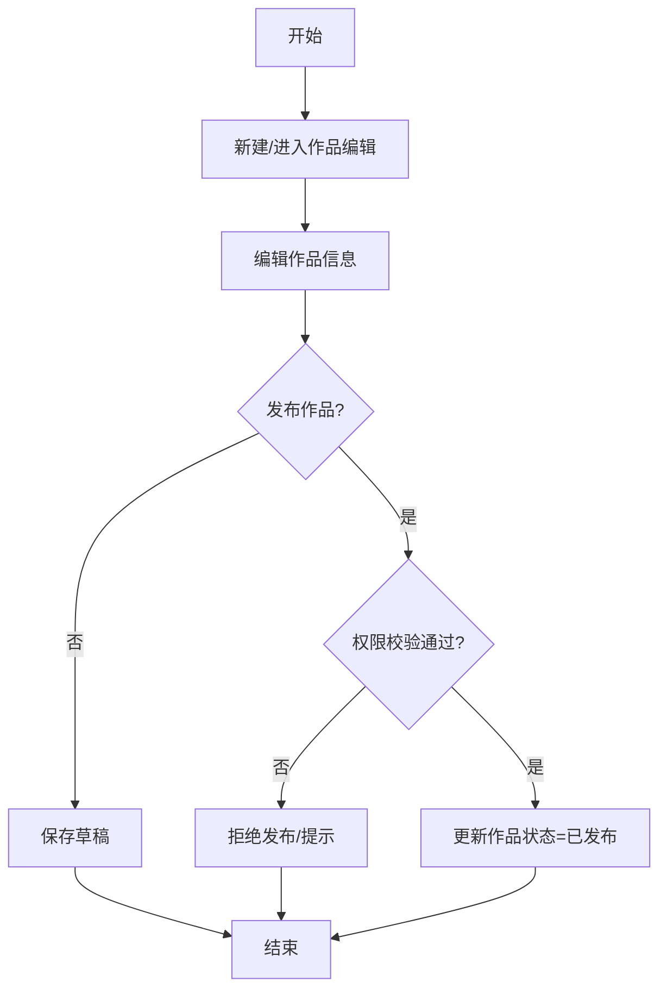

#### 4.2.5 创意广场与社区互动模块

模块功能：该模块提供作品展示与社区交互能力，包含作品列表浏览、搜索与排序（热度/时间/标签等）、作品详情查看，以及点赞、收藏、评论、关注等互动功能。模块通过将互动行为与作品数据关联，形成反馈闭环，提升作品传播与社区活跃度。

模块功能结构图：

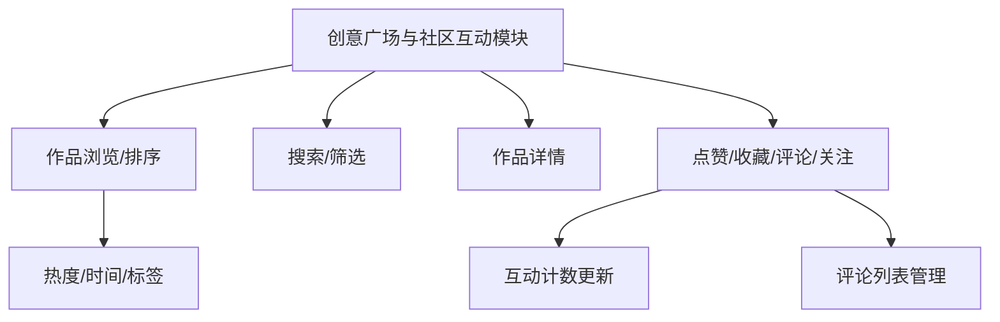

模块流程描述：用户进入创意广场后，前端请求作品列表并支持排序与筛选；用户打开作品详情页后加载作品信息、互动数据；当用户进行点赞、收藏或评论时，前端提交互动请求，后端校验登录状态并写入互动记录，更新计数并返回最新状态以刷新页面展示。

模块流程图：

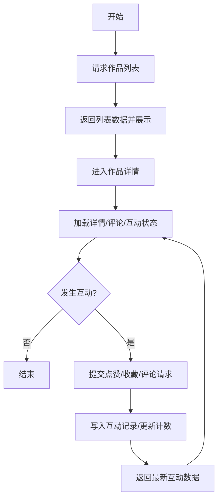

#### 4.2.6 后台管理模块

模块功能：该模块面向系统管理员提供用户管理、模型管理与内容治理能力，包括用户管理（信息维护，权限分配）、作品内容审核（通过/拒绝/下架）、模型库维护等功能。模块通过权限控制与审核流程保障平台内容质量与资源可用性。

模块功能结构图：

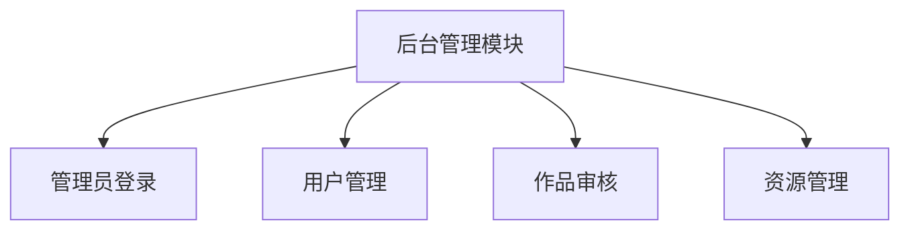

模块流程描述：管理员登录后进入后台；在用户管理中可检索用户并执行角色分配，信息修改等操作；在作品审核中查看待审内容并做出通过或拒绝决定，必要时可对已发布内容执行下架；在资源管理中维护模型资源，保证前端定制能力与内容展示的基础数据完整。

模块流程图：

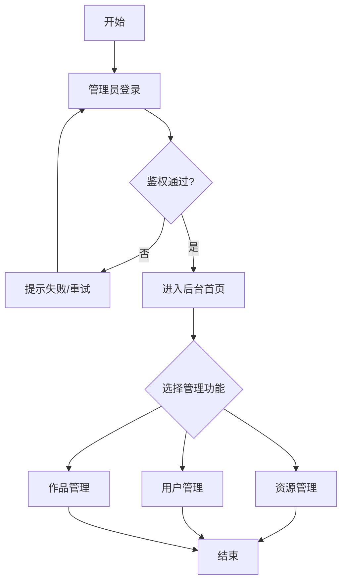

### 4.3 系统数据库设计

#### 4.3.1 数据库实体联系分析

根据第 3 章系统需求分析，得出以下结论：

- 本系统数据库可划分为三个核心子域：用户域（ users ）、作品广场域（ design\_works 及互动表）、任务域（ tryon\_tasks ），并由资源域（ model\_files ）提供文件支撑。

* users 为全局主体实体，承担身份认证与角色区分功能（普通用户/管理员），并作为作品发布、点赞、收藏、评论、试衣任务发起的统一行为主体。
* design\_works 为业务核心实体，记录作品基础信息（标题、描述、状态、发布时间等），通过 user\_id 关联作品作者；通过 cover\_file\_id 关联封面资源。
* model\_files 用于统一管理文件资源（名称、URL、大小），在当前模型中主要被作品封面复用，形成“一个文件可被多个作品引用、一个作品最多一个封面文件”的关系。
* work\_tags 、 work\_likes 、 work\_favorites 、 work\_comments 构成作品互动子模型：
  - 标签（ work\_tags ）表达作品的语义分类；
  - 点赞（ work\_likes ）与收藏（ work\_favorites ）是用户与作品的多对多关系落地；
  - 评论（ work\_comments ）表达用户对作品的一对多文本反馈。
* tryon\_tasks 表示用户针对作品触发的试衣生成任务，记录任务状态、进度、结果地址与异常信息，形成“用户—任务”“作品—任务”的双一对多关系。
* 一致性方面，互动表对作品设置了外键级联删除；同时点赞/收藏通过 (work\_id, user\_id) 唯一约束防止重复行为。 design\_works 中的计数字段（点赞数、评论数、收藏数）属于冗余统计字段，用于提高查询性能。

**主要联系**

- 用户 users 与作品 design\_works ：1 对 N（一个用户可发布多个作品）
- 资源文件 model\_files 与作品 design\_works ：1 对 N（一个文件可作为多个作品封面）
- 作品 design\_works 与标签 work\_tags ：1 对 N
- 用户 users 与点赞 work\_likes ：1 对 N；作品 design\_works 与点赞 work\_likes ：1 对 N
- 用户 users 与收藏 work\_favorites ：1 对 N；作品 design\_works 与收藏 work\_favorites ：1 对 N
- 用户 users 与评论 work\_comments ：1 对 N；作品 design\_works 与评论 work\_comments ：1 对 N
- 用户 users 与试衣任务 tryon\_tasks ：1 对 N；作品 design\_works 与试衣任务 tryon\_tasks ：1 对 N

根据以上分析，系统的 ER 图，如图所示。

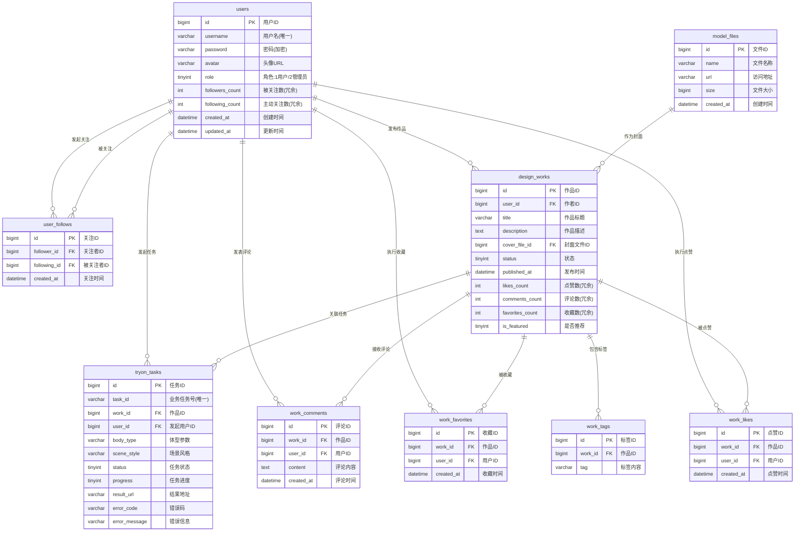

#### 4.3.2 数据库核心数据表

**1）users（用户核心表）**  
  **表作用**：存储系统用户账号、密码、角色与基础资料，是全局用户主体表。  
  **表结构**：

  | 字段名 | 类型 | 约束/索引 | 说明 |
  |---|---|---|---|
  | id | bigint(20) UNSIGNED | PK, AUTO_INCREMENT | 主键ID |
  | username | varchar(50) | NOT NULL, UNIQUE(uk_username) | 登录用户名（唯一） |
  | password | varchar(255) | NOT NULL | 加密后的密码 |
  | avatar | varchar(255) | DEFAULT NULL | 头像URL |
  | role | tinyint(2) UNSIGNED | NOT NULL, DEFAULT 1 | 角色：1-普通用户，2-管理员 |
  | created_at | datetime | DEFAULT CURRENT_TIMESTAMP | 注册时间 |
  | updated_at | datetime | DEFAULT CURRENT_TIMESTAMP ON UPDATE CURRENT_TIMESTAMP | 最后更新时间 |

---

**2）model_files（模型/资源文件表）**  
  **表作用**：统一管理文件资源元数据（名称、URL、大小），可被作品引用等。  
  **表结构**：

  | 字段名 | 类型 | 约束/索引 | 说明 |
  |---|---|---|---|
  | id | bigint(20) UNSIGNED | PK, AUTO_INCREMENT | 主键ID |
  | name | varchar(255) | NOT NULL, DEFAULT '' | 展示名称 |
  | url | varchar(1024) | NOT NULL | 访问URL |
  | size | bigint(20) UNSIGNED | NOT NULL, DEFAULT 0 | 文件大小(byte) |
  | created_at | datetime | DEFAULT CURRENT_TIMESTAMP | 创建时间 |
  | updated_at | datetime | DEFAULT CURRENT_TIMESTAMP ON UPDATE CURRENT_TIMESTAMP | 更新时间 |
  |  |  | KEY idx_name(name) | 名称索引 |

---

**3）design_works（作品主表）**  
  **表作用**：存储作品主体信息，是创意广场的核心业务表。  
  **表结构**：

  | 字段名 | 类型 | 约束/索引 | 说明 |
  |---|---|---|---|
  | id | bigint(20) UNSIGNED | PK, AUTO_INCREMENT | 作品ID |
  | user_id | bigint(20) UNSIGNED | NOT NULL, KEY idx_user(user_id) | 作者用户ID |
  | title | varchar(255) | NOT NULL, DEFAULT '' | 作品标题 |
  | description | text |  | 作品描述 |
  | cover_file_id | bigint(20) UNSIGNED | DEFAULT NULL | 封面文件ID |
  | current_version_id | bigint(20) UNSIGNED | DEFAULT NULL | 当前版本ID（版本管理字段，可忽略） |
  | status | tinyint(3) UNSIGNED | NOT NULL, DEFAULT 1, KEY idx_status(status) | 作品状态 |
  | published_at | datetime | DEFAULT NULL | 发布时间 |
  | created_at | datetime | DEFAULT CURRENT_TIMESTAMP | 创建时间 |
  | updated_at | datetime | DEFAULT CURRENT_TIMESTAMP ON UPDATE CURRENT_TIMESTAMP | 更新时间 |
  | likes_count | int | NOT NULL, DEFAULT 0 | 点赞数（冗余统计） |
  | comments_count | int | NOT NULL, DEFAULT 0 | 评论数（冗余统计） |
  | favorites_count | int | NOT NULL, DEFAULT 0 | 收藏数（冗余统计） |
  | is_featured | tinyint(1) | NOT NULL, DEFAULT 0 | 是否推荐 |

---

**4）work_tags（作品标签表）**  
  **表作用**：维护作品与标签的关联，用于分类、检索与推荐。  
  **表结构**：

  | 字段名 | 类型 | 约束/索引 | 说明 |
  |---|---|---|---|
  | id | bigint(20) UNSIGNED | PK, AUTO_INCREMENT | 主键ID |
  | work_id | bigint(20) UNSIGNED | NOT NULL, FK->design_works(id), INDEX idx_work_id(work_id) | 作品ID |
  | tag | varchar(32) | NOT NULL, INDEX idx_tag(tag) | 标签内容 |

---

**5）work_likes（作品点赞表）**  
  **表作用**：记录用户对作品的点赞行为。  
  **表结构**：

  | 字段名 | 类型 | 约束/索引 | 说明 |
  |---|---|---|---|
  | id | bigint(20) UNSIGNED | PK, AUTO_INCREMENT | 主键ID |
  | work_id | bigint(20) UNSIGNED | NOT NULL, FK->design_works(id) | 作品ID |
  | user_id | bigint(20) UNSIGNED | NOT NULL | 点赞用户ID |
  | created_at | datetime | DEFAULT CURRENT_TIMESTAMP | 点赞时间 |
  |  |  | UNIQUE uk_work_user(work_id, user_id) | 防止重复点赞 |

---

**6）work_favorites（作品收藏表）**  
  **表作用**：记录用户对作品的收藏行为。  
  **表结构**：

  | 字段名 | 类型 | 约束/索引 | 说明 |
  |---|---|---|---|
  | id | bigint(20) UNSIGNED | PK, AUTO_INCREMENT | 主键ID |
  | work_id | bigint(20) UNSIGNED | NOT NULL, FK->design_works(id) | 作品ID |
  | user_id | bigint(20) UNSIGNED | NOT NULL | 收藏用户ID |
  | created_at | datetime | DEFAULT CURRENT_TIMESTAMP | 收藏时间 |
  |  |  | UNIQUE uk_work_user(work_id, user_id) | 防止重复收藏 |

---

**7）work_comments（作品评论表）**  
  **表作用**：记录用户对作品的文本评论内容。  
  **表结构**：

  | 字段名 | 类型 | 约束/索引 | 说明 |
  |---|---|---|---|
  | id | bigint(20) UNSIGNED | PK, AUTO_INCREMENT | 主键ID |
  | work_id | bigint(20) UNSIGNED | NOT NULL, FK->design_works(id), INDEX idx_work_id(work_id) | 作品ID |
  | user_id | bigint(20) UNSIGNED | NOT NULL | 评论用户ID |
  | content | text | NOT NULL | 评论内容 |
  | created_at | datetime | DEFAULT CURRENT_TIMESTAMP | 评论时间 |

---

**8）tryon_tasks（试衣任务表）**  
  **表作用**：记录用户针对作品发起的试衣任务及执行结果。  
  **表结构**：

  | 字段名 | 类型 | 约束/索引 | 说明 |
  |---|---|---|---|
  | id | bigint(20) UNSIGNED | PK, AUTO_INCREMENT | 主键ID |
  | task_id | varchar(64) | NOT NULL, UNIQUE uk_task_id(task_id) | 业务任务号 |
  | work_id | bigint(20) UNSIGNED | NOT NULL, KEY idx_work_id(work_id) | 关联作品ID |
  | version_id | bigint(20) UNSIGNED | NOT NULL | 版本ID（版本管理字段，可忽略） |
  | user_id | bigint(20) UNSIGNED | NOT NULL, KEY idx_user_id(user_id) | 发起用户ID |
  | body_type | varchar(64) | NOT NULL, DEFAULT '' | 体型参数 |
  | scene_style | varchar(64) | NOT NULL, DEFAULT '' | 场景风格 |
  | input_refs | json | NOT NULL | 输入参考数据 |
  | status | tinyint(3) UNSIGNED | NOT NULL, DEFAULT 1, KEY idx_status(status) | 任务状态 |
  | progress | tinyint(3) UNSIGNED | NOT NULL, DEFAULT 0 | 任务进度 |
  | result_url | varchar(1024) | NOT NULL, DEFAULT '' | 结果地址 |
  | error_code | varchar(64) | NOT NULL, DEFAULT '' | 错误码 |
  | error_message | varchar(1024) | NOT NULL, DEFAULT '' | 错误信息 |
  | started_at | datetime | DEFAULT NULL | 开始时间 |
  | finished_at | datetime | DEFAULT NULL | 完成时间 |
  | created_at | datetime | DEFAULT CURRENT_TIMESTAMP, KEY idx_created_at(created_at) | 创建时间 |
  | updated_at | datetime | DEFAULT CURRENT_TIMESTAMP ON UPDATE CURRENT_TIMESTAMP | 更新时间 |
